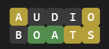

# `worder` CLI for querying the dictionary for 5 letter words

Install with npm

```
npm install -g kyle-west/worder
```

Say you got this far, and you want to see what your options are:

<!-- <span style="background:#b59f3b; color:white; font-family:Consolas,monospace; font-size:16px; width:24px; height:24px; display:inline-block; text-align:center; border-radius:4px;">A</span><span style="background:#3a3a3c; color:white; font-family:Consolas,monospace; font-size:16px; width:24px; height:24px; display:inline-block; text-align:center; border-radius:4px;">U</span><span style="background:#3a3a3c; color:white; font-family:Consolas,monospace; font-size:16px; width:24px; height:24px; display:inline-block; text-align:center; border-radius:4px;">D</span><span style="background:#3a3a3c; color:white; font-family:Consolas,monospace; font-size:16px; width:24px; height:24px; display:inline-block; text-align:center; border-radius:4px;">I</span><span style="background:#b59f3b; color:white; font-family:Consolas,monospace; font-size:16px; width:24px; height:24px; display:inline-block; text-align:center; border-radius:4px;">O</span><br/>
<span style="background:#3a3a3c; color:white; font-family:Consolas,monospace; font-size:16px; width:24px; height:24px; display:inline-block; text-align:center; border-radius:4px;">B</span><span style="background:#538d4e; color:white; font-family:Consolas,monospace; font-size:16px; width:24px; height:24px; display:inline-block; text-align:center; border-radius:4px;">O</span><span style="background:#538d4e; color:white; font-family:Consolas,monospace; font-size:16px; width:24px; height:24px; display:inline-block; text-align:center; border-radius:4px;">A</span><span style="background:#b59f3b; color:white; font-family:Consolas,monospace; font-size:16px; width:24px; height:24px; display:inline-block; text-align:center; border-radius:4px;">T</span><span style="background:#b59f3b; color:white; font-family:Consolas,monospace; font-size:16px; width:24px; height:24px; display:inline-block; text-align:center; border-radius:4px;">S</span> -->



At this point you could run `worder` for a little help. To say _I want a word where the second and third letters are "OA" that contains a "T" and an "S", but no "U", "D", "I", or "B"_ you could use this command:

```
worder search _OA__ --yes TS --no UDIB
```

Which would give you this as output to help you guess the word:

```js
[
  'coast', 'coats',
  'goats', 'hoast',
  'moats', 'roast',
  'toast'
]
```

## Complete `worder search` API

```
Usage: worder search [options] [pattern]

List all the words that match with the given pattern

Arguments:
  pattern                           String Pattern. Examples: "T__ST" or a RegExp

Options:
  -y, --yes <characters>            what characters SHOULD appear in the word?
  -n, --no <characters>             what characters should NOT appear in the word?
  -s, --startsWith <wordBeginning>  what characters does the word start with?
  -e, --endsWith <wordEnding>       what characters does the word end with?
  -h, --help                        display help for command
```